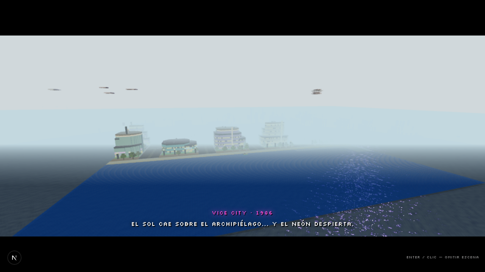

# 🌴 GRAND THEFT VOXEL — Vice City (edición Minecraft)

Mundo abierto **voxel estilo Minecraft** con **jugabilidad GTA** en primera persona (V para tercera), ambientado en **Vice City, 1986**. Todo el juego corre en el navegador con Three.js — sin instalar nada.

## 🎮 JUGAR

### **→ https://googlesitecom.github.io/GTV/**

Clic en la pantalla para capturar el ratón. Teclado + ratón.

## 🕹️ Controles (personalizables desde el menú → CONTROLES)

| Tecla | Acción |
|---|---|
| **W A S D** | Moverse |
| **SHIFT** | Correr / esprintar |
| **ESPACIO** | Saltar · Freno de mano (en coche) |
| **E** | Interactuar · **robar coches** · entrar/salir |
| **F** / **CLIC IZQ** | Golpear / disparar |
| **X** / **CLIC DER** | Apuntar (ADS) |
| **TAB** | Rueda de armas |
| **1 – 6** | Armas (6 = RPG) |
| **V** | Cámara 1ª / 3ª persona |
| **M** | Mapa de la isla |
| **R** | Radio del coche |
| **H** | Trabajos (TAXI / VIGILANTE / REPARTO) |
| **G** | Bocina |
| **ESC** | Pausa |

## 💰 Qué hacer

- **Roba autos** (E) y huye de la **VCPD**: 5 estrellas de búsqueda con patrullas, SWAT, blindados y **helicóptero policial** (caible con RPG).
- **Roba el banco** de Downtown, atracas, busca los **paquetes ocultos**.
- Compra **casas**, coches en **VICE AUTOS** y armas en la armería.
- **Derrapa** con freno de mano estilo GTA VC, con marcas de neumático.
- Modo **HISTORIA** con misiones cinematográficas o **MUNDO ABIERTO** libre.
- Reloj y clima dinámicos (casi siempre soleado ☀️), radio con 3 emisoras synthwave.

## 🗂️ Estructura del repo

```
index.html          ← EL JUEGO COMPLETO (JS + CSS incrustados, sin CDNs)
models/             ← tus modelos GLB originales (coches, heli, Steve, armas, roble)
audio/menu.mp3      ← tema del menú (Musica_menu.mp3)
audio/radio/        ← sube aquí 1.mp3 … 16.mp3 y entran a RADIO USB
fonts/              ← fuentes auto-hospedadas (Silkscreen, Rajdhani, Righteous…)
og-image.png        ← imagen para compartir
```

## 🎵 Personalizar la música

- **Menú**: sustituye `audio/menu.mp3` (también acepta .ogg/.wav).
- **Radio USB**: sube `audio/radio/1.mp3`, `2.mp3`… hasta 16 canciones (.mp3/.ogg/.wav) y aparecerá la emisora **RADIO USB** en cualquier coche (tecla R).

## ⚙️ Detalles técnicos

- Three.js con **shaders portados de Eaglercraft** (texel-snap, niebla MC, bloom, god rays, FXAA, ACES) y calidad adaptativa.
- Los 11 modelos GLB del repo son los que se usan en juego (coche Minecraft, supercar, Crown Victoria de policía, blindado, helicóptero, Steve con skin auténtica, 4 armas y el roble).
- Guardado automático en el navegador (progreso, casas, récords, controles).
- 100% estático: sirve desde GitHub Pages sin backend.

## 📸


